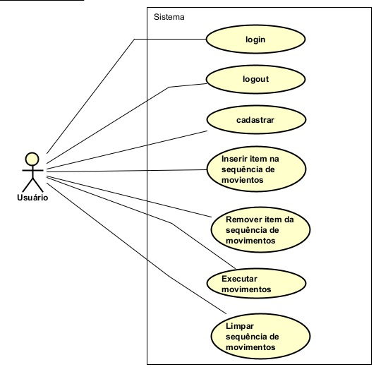
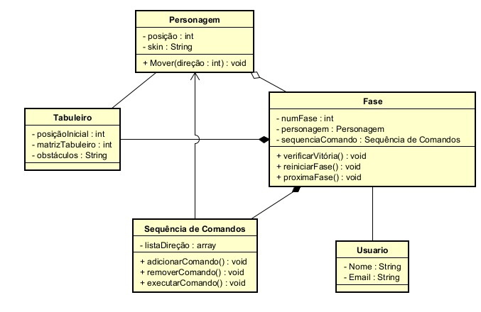
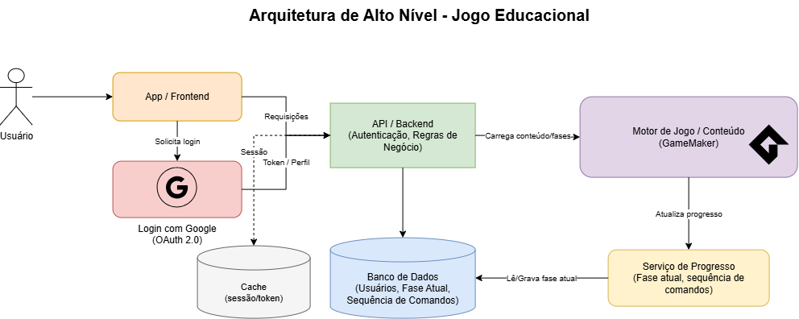

<h1 align="center">🎮 Move Quest 🎮</h1> 

Projeto desenvolvido para a disciplina **Oficina de Integração 2**, em parceria com o projeto de extensão **ELLP — Ensino Lúdico de Lógica e Programação**.

A proposta consiste no desenvolvimento de um jogo educativo em que o jogador deverá criar uma sequência de comandos para movimentar um personagem por um tabuleiro até alcançar um objetivo.

---

## 📌 Sobre o projeto

O jogo será composto por um tabuleiro dividido em células. Em cada fase, o personagem inicia em uma determinada posição e deverá chegar até um objetivo localizado em outro ponto do mapa.

Para movimentar o personagem, o jogador poderá inserir quatro tipos de comandos:

- ⬆️ Cima
- ⬇️ Baixo
- ⬅️ Esquerda
- ➡️ Direita

Os comandos escolhidos serão adicionados a uma sequência. Depois de finalizar a programação, o jogador poderá pressionar **Play** para que o personagem execute os movimentos na ordem definida.

A proposta inicial prevê **três fases**, com aumento gradual de dificuldade:

- **Fase 1:** introdução à mecânica e movimentação básica;
- **Fase 2:** inclusão de obstáculos;
- **Fase 3:** aumento da quantidade de obstáculos e da complexidade do caminho.

O objetivo é estimular o raciocínio lógico e trabalhar conceitos introdutórios de lógica de programação de forma lúdica.

---

# 📋 Planejamento

Esta seção reúne os principais artefatos da etapa de planejamento do projeto.

## 1. Requisitos Funcionais

| ID | Descrição | Prioridade |
| :--- | :--- | :--- |
| **RF01** | O sistema deve permitir que o usuário se cadastre | Essencial |
| **RF02** | O sistema deve permitir que o usuário realize “login” | Essencial |
| **RF03** | O sistema deve permitir que o usuário realize “logout” | Importante |
| **RF04** | O sistema deve permitir que o usuário insira comandos de movimento a sequência | Essencial |
| **RF05** | O sistema deve permitir que o usuário limpe a sequência | Desejável |
| **RF06** | O sistema deve exibir a sequência de comandos na tela | Essencial |
| **RF07** | O sistema deve permitir que o usuário remova comandos de movimento da sequência | Essencial |
| **RF08** | O sistema deve iniciar a execução de sequência de movimentos quando o jogador apertar “Play” | Essencial |
| **RF09** | O sistema deve mover o personagem bloco a bloco de acordo com a sequência de movimentos definida | Essencial |
| **RF10** | O sistema deve interromper a execução caso o personagem colida com algum obstáculo ou saia do mapa | Essencial |
| **RF11** | O sistema deve notificar “derrota” caso o personagem colida com algum obstáculo ou saia do mapa | Desejável |
| **RF12** | O sistema deve notificar “vitória” caso o personagem chegue ao objetivo final | Desejável |
| **RF13** | O sistema deve reiniciar a fase caso o personagem não chegue ao objetivo final | Importante |
| **RF14** | O sistema deve avançar de fase caso o personagem chegue ao objetivo final | Desejável |
| **RF15** | O sistema deve persistir a fase que o jogador se encontra | Importante |

---

## 2. Diagrama de Casos de Uso

O diagrama abaixo representa as principais ações disponíveis ao usuário no sistema, incluindo autenticação e interação com a sequência de movimentos.

Entre as principais ações do usuário estão:

- cadastrar-se;
- realizar login;
- realizar logout;
- inserir movimentos na sequência;
- remover movimentos da sequência;
- limpar a sequência;
- executar os movimentos.

---

## 3. Diagrama de Classes

O diagrama de classes apresenta as principais entidades inicialmente identificadas para o sistema:

- **Usuário**
- **Fase**
- **Personagem**
- **Tabuleiro**
- **Sequência de Comandos**

A modelagem poderá ser refinada ao longo do desenvolvimento conforme os requisitos e decisões de implementação forem validados.

---

## 4. Arquitetura em alto nível do sistema

## 5. Tecnologias

As tecnologias serão definidas e validadas com o professor antes do início da implementação.

| Categoria                | Tecnologia   |
| ------------------------ | ------------ |
| Desenvolvimento de jogo  | GameMaker    |
| Front-end                | A definir    |
| Back-end                 | A definir    |
| Banco de dados           | A definir    |
| Autenticação             | Google       |
| Testes automatizados     | A definir    |
| Versionamento            | Git / GitHub |
| Gerenciamento de tarefas | Trello       |

---

## 6. Estratégia de Testes Automatizados

Com a definição da arquitetura dividindo o sistema entre um App/Frontend com API Backend e o Motor de Jogo (GameMaker), a automação de testes será separada em duas frentes tecnológicas. Essa abordagem garante a métrica de cobertura exigida pelo projeto sem esbarrar nas conhecidas limitações e instabilidades de realizar testes visuais diretamente na renderização do jogo.

### 6.1. Ecossistema Web e Backend (API)
Foco na lógica de negócios externa, persistência de dados e autenticação de usuários.

* **Testes de Unidade e Integração (Backend):**
  * **Autenticação:** Utilização de mocks para simular o retorno do provedor OAuth 2.0 (Google), garantindo que a sessão/token valide corretamente o acesso do usuário.
  * **Serviço de Progresso:** Validação das rotas que gravam e leem o estado atual no Banco de Dados, como a fase do jogador e as sequências de comandos executadas.
  * **Tecnologias sugeridas:** Jest com Supertest (para stack Node.js) ou JUnit com Mockito (para stack Java Spring).

* **Testes End-to-End (E2E / Frontend):**
  * **Fluxo Crítico:** Validação pontual do caminho feliz: acessar a aplicação, realizar o login com Google e ser redirecionado para o carregamento do conteúdo no motor de jogo.
  * **Tecnologias sugeridas:** Playwright ou Cypress.

### 6.2. Lógica do Jogo (GameMaker)
Automatizar testes dentro da *engine* exige o princípio de "Lógica Desacoplada", separando as regras matemáticas e de estado da renderização gráfica (eventos de *Draw*).

* **Testes de Unidade (Scripts GML):**
  * **Fila de Comandos:** Testar diretamente os métodos da classe `Sequência de Comandos` para garantir que `adicionarComando()`, `removerComando()` e a limpeza do array `listaDireção` funcionem sob qualquer condição.
  * **Movimentação e Limites:** Chamar os métodos de movimentação e verificar se as coordenadas do `Personagem` são atualizadas e se ultrapassar a `matrizTabuleiro` gera um bloqueio imediato.
  * **Vitória e Colisão:** Injetar coordenadas simuladas para testar de forma isolada os retornos lógicos de `verificarVitória()` e das colisões com os `obstáculos`.
* **Tecnologias sugeridas:** Criação de scripts de asserção customizados (ex: `assert_equal(esperado, resultado)`) executados de forma oculta (*headless*) com logs no console de *Output*, ou uso de frameworks da comunidade (como o GMRT - GameMaker Robo Tester).

### 6.3. Integração Contínua (CI) e Métrica de Cobertura
* **Pipeline Automatizado:** Criação de *workflows* no **GitHub Actions** para rodar automaticamente os testes da API a cada *Pull Request* e *Push* nas *branches* principais.
* **Cobertura e Artefatos:** Configuração de relatórios de cobertura (ex: *Istanbul*/*JaCoCo*) no backend visando a meta do projeto ($\ge 80\%$ nas regras centrais), atuando como *Quality Gate* para bloquear *merges* que quebrem as funcionalidades existentes.
---

# 🗓️ Cronograma

| Semana            | Atividades                                                                                                                                                                         |
| ----------------- | ---------------------------------------------------------------------------------------------------------------------------------------------------------------------------------- |
| **08/09 a 14/09** | Reuniões entre os integrantes do grupo para análise das propostas disponíveis, definição inicial da ideia e levantamento de requisitos.                                            |
| **15/09 a 21/09** | Reunião com o professor no dia **15/09** para apresentação e discussão da proposta. Continuação das reuniões do grupo para refinamento da ideia e dos requisitos.                  |
| **22/09 a 28/09** | Finalização do planejamento: requisitos funcionais, arquitetura, tecnologias, estratégia de testes, organização do GitHub/Kanban e cronograma. **Entrega do Planejamento: 28/09.** |
| **29/09 a 05/10** | Configuração inicial do projeto e desenvolvimento da estrutura básica do jogo.                                                                                                     |
| **06/10 a 12/10** | Desenvolvimento da sequência de comandos e da lógica principal de movimentação.                                                                                                    |
| **13/10 a 16/10** | Integração das funcionalidades, implementação da primeira fase, testes e correções. **Entrega da Sprint 1: 16/10.**                                                                |
| **17/10 a 23/10** | Implementação de obstáculos e ajustes apontados após a Sprint 1.                                                                                                                   |
| **24/10 a 30/10** | Desenvolvimento e testes da segunda fase.                                                                                                                                          |
| **31/10 a 06/11** | Desenvolvimento e testes da terceira fase.                                                                                                                                         |
| **07/11 a 13/11** | Desenvolvimento e integração das funcionalidades de usuário, autenticação e persistência.                                                                                          |
| **14/11 a 20/11** | Melhorias na interface e integração geral das funcionalidades.                                                                                                                     |
| **21/11 a 27/11** | Testes automatizados, análise de cobertura, correção de bugs e ajustes finais.                                                                                                     |
| **28/11 a 30/11** | Revisão final, documentação e preparação da apresentação. **Entrega da Sprint 2: 30/11.**                                                                                          |

---

# 👥 Equipe

| Integrante                         | RA      |
| ---------------------------------- | ------- |
| Augusto Thiago dos Santos Laureano | 2565781 |
| Beatriz Milanezi Lopes             | 2588420 |
| Jefferson Lima Silva               | 2601419 |
| Nádia Akemi Yuzawa                 | 2576279 |
| Vitor Akio Suguimoto Kaneko        | 2576350 |

